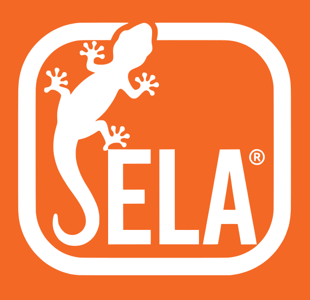

# 病歷整理器 (Chart)

> 彰濱癌症中心 · Chang Bing Show Chwan Memorial Hospital  
> © SELA · Radiation Oncology

---

## 簡介

病歷整理器是一款用於整理和輸出病歷資料的網頁應用程式，專為放射腫瘤科設計。可於瀏覽器中離線使用，亦可部署於 GitHub Pages。

---

## 功能特色

- **密碼保護**：開啟時需輸入密碼（預設 RTO）
- **8 個分頁管理**：Prompt、病人資料、病摘、檢驗、病理、影像、預覽、AI
- **10 個 Prompt 範本**：編輯/儲存/命名分開操作
- **預設範本載入**：密碼保護，可選擇多組預設範本
- **病人資料管理**：姓名、年齡、病歷號、ECOG、衰弱量表
- **檢驗資料**：自由輸入 + 腫瘤指數追蹤
- **報告管理**：病理報告與影像報告
- **AI 整理功能**：支援 OpenAI / Claude API 自動整理病歷
- **匯出功能**：支援 TXT、HTML、PDF 格式
- **個資遮蔽**：預設開啟，預覽及匯出時自動遮蔽病人姓名

---

## 版本歷程

### V7.0.9 (2026-10-02)
**預設範本 1「放腫病歷整理」改版（結構重整）：**
- 改為「輸出骨架 + 各節規則 + 輸出前自我檢查」結構
- 不可自行推導 TNM；來源矛盾時依規則選擇或兩筆並列
- 新增【PET/CT】專節（FINDINGS/IMPRESSION 配對、DDx 含惡性者保留、SUVmax 兩值保留）與範例
- 分子形態演變總覽 Subtype 限四類（HR+/HER2-、HR+/HER2+、HR-/HER2+、TNBC）
- 治療計畫只記已執行或已決定的治療；no distant mets 不可擴大解釋
- 日期統一 YYYY/MM/DD

---

### V7.0.8 (2026-10-02)
**預設範本 1「放腫病歷整理」更新：**
- cTNM / pTNM 獨立欄位，有手術者兩者並列；新增【分期】規則
- 診斷句新增非乳癌有手術、術前治療格式；乳癌切片與手術檢體病理不一致時分開寫
- Present Illness 寫到病理診斷為止
- Social History 改為 Smoking(-) Alcohol(-) Betel nut(-) 格式，未記載時輸出兩行
- 乳癌 Gynecologic / Breast History 固定六項（含 Breastfeeding）
- 影像：疑似惡性發現與 imaging staging 不可刪除

---

### V7.0.7 (2026-05-08)
**首次對齊 SELA-Starter-Kit V1.8.2：**
- 換上 SELA favicon 套組（高清）
- 新增 .gitignore
- 新增 CLAUDE.md
- 新增 SELA-handoff.md
- zip 命名格式對齊（空格分隔）

---

### V6.15.x (2026-05-08)
- V6.15.1：Kit 對齊（頂部註解、theme-color）
- V6.15.0：密碼保護（RTO）、預載範本升級 v4 整合版

---

### V6.14.x (2026-04-29)
- V6.14.2：預載範本更新（放腫病歷整理 v3）
- V6.14.1：AI 服務選單直接可選
- V6.14.0：UI 一致性優化

---

### V6.13.x
- V6.13.2：「重填」按鈕、病理分類新增分子檢測
- V6.13.1：Prompt 分頁清除按鈕
- V6.13.0：遮蔽姓名移至病人分頁、三組預設範本

---

### V6.12.x ~ V6.10.x
- 預設範本載入目標選擇
- 密碼保護預設範本
- localStorage key 修正

---

## 預設範本說明

| 範本名稱 | 用途 |
|---------|------|
| 放腫病歷整理 | 放射腫瘤科病歷結構化摘要（v4 整合版） |
| 多專科會議 JSON | MDT 會議系統資料轉換格式 |
| 影像規範 | 腫瘤影像報告摘要標準 |

---

## 技術規格

| 項目 | 說明 |
|------|------|
| 字型 | Noto Sans TC (Google Fonts) |
| 圖示 | SELA favicon 套組 |
| PDF 匯出 | html2canvas + jsPDF |
| 資料儲存 | localStorage |
| AI 整合 | OpenAI API / Anthropic API |
| 密碼驗證 | sessionStorage |

---

## 授權

© SELA · Radiation Oncology · CBSHOW

Made by SELA · V7.0.9
